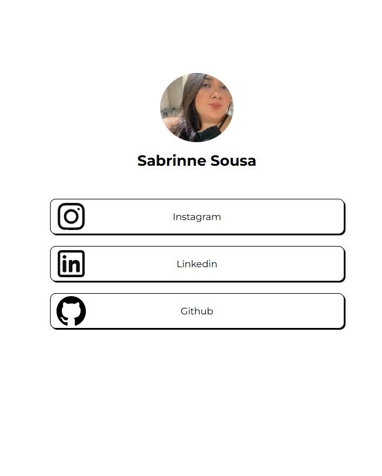

# LinkTree - Projeto em HTML + CSS 👩‍💻

Este é um projeto simples de **LinkTree**, inspirado na plataforma Linktree, onde você pode criar uma página de links personalizada para compartilhar facilmente suas redes sociais e outros links importantes.

O projeto foi desenvolvido utilizando **HTML** e **CSS** para estruturar e estilizar a página de maneira simples e eficiente.

## Funcionalidades

- Apresentação de links para redes sociais (Instagram, Twitter, LinkedIn, GitHub, etc.)
- Design responsivo, adaptável para dispositivos móveis
- Estilo visual simples e moderno

## Tecnologias Utilizadas

- **HTML5**: Estrutura da página e dos links.
- **CSS3**: Estilo visual, incluindo fontes, cores e layout responsivo.

## Como Usar

1. Clone este repositório para sua máquina local:

```bash
git clone https://github.com/seu-usuario/linktree.git
```
Acesse o projeto: https://sabrinnesousa.github.io/LinkTree/
